# Jewellery Garden - Complete Homepage UI/UX Design Specification (`design.md`)

> **Target Workspace Path**: `/Users/souvikbasu/Downloads/GrowGlobal/Jewellery Garden/Md_Files/design.md`  
> **Source Website Analyzed**: [Jewellery Garden](https://sencogoldanddiamonds.com/)  
> **Document Purpose**: Comprehensive visual design blueprint, design system, component architecture, and section-by-section structural layout for pixel-exact frontend development.

---

## 1. Executive Summary & Design Vision

The **Jewellery Garden** homepage design represents a premier Indian luxury e-commerce experience. It balances traditional Indian heritage craftsmanship with a modern, high-converting digital storefront.

### Core Visual Principles
- **Royal Indian Luxury Aesthetic**: Deep crimson red (`#C8232A`) blended with warm metallic gold accents (`#D4AF37` / `#E5C365`) and soft off-white/cream backgrounds (`#FAF8F5`).
- **High Visual Contrast & Clarity**: Clean typography pairing classic luxury serif headings (`Fraunces` / `Playfair Display`) with modern crisp sans-serif UI typography (`Poppins` / `Lato`).
- **Rich Media & Micro-Interactions**: Dynamic hero carousels, 3D video reel cards, hover-zoom image effects, sticky navigation header, and interactive budget/category filter cards.
- **Trust & Transparency Focus**: Prominent scheme integration (`Jewellery Garden Schemes`, `myDigiGold`, `myDigiSilver`), BIS Hallmark & Certified Diamond badges, and transparent pricing breakdowns.

---

## 2. Design System & Tokens (CSS Variables Blueprint)

```css
:root {
  /* ==========================================================================
     COLOR SYSTEM
     ========================================================================== */
  /* Brand Primary Colors */
  --color-primary-red: #C8232A;
  --color-primary-red-hover: #B81D24;
  --color-primary-red-dark: #9E1B21;
  --color-footer-red: #CC2529;

  /* Accent & Metallic Gold Colors */
  --color-gold-primary: #D4AF37;
  --color-gold-light: #F0D588;
  --color-gold-accent: #E5C365;
  --color-gold-border: #C5A059;
  --color-gold-bg-light: #FFFBF0;

  /* Neutral Background Colors */
  --color-bg-main: #FAF8F5;
  --color-bg-card: #FFFFFF;
  --color-bg-topbar: #F4F6F9;
  --color-bg-seo-footer: #F9F6F0;
  
  /* Text & Neutral Colors */
  --color-text-primary: #1A1A1A;
  --color-text-secondary: #555555;
  --color-text-muted: #777777;
  --color-text-light: #FFFFFF;

  /* Border & Divider Colors */
  --color-border-light: #E8E3DA;
  --color-border-subtle: #F0EDE6;
  --color-border-dark: #333333;

  /* ==========================================================================
     TYPOGRAPHY SYSTEM
     ========================================================================== */
  --font-heading: 'Fraunces', 'Playfair Display', Georgia, serif;
  --font-body: 'Poppins', 'Lato', -apple-system, BlinkMacSystemFont, sans-serif;

  /* Font Sizes */
  --font-size-xs: 11px;
  --font-size-sm: 13px;
  --font-size-base: 14px;
  --font-size-md: 16px;
  --font-size-lg: 18px;
  --font-size-xl: 22px;
  --font-size-2xl: 28px;
  --font-size-3xl: 34px;
  --font-size-hero: 44px;

  /* Line Heights */
  --line-height-tight: 1.2;
  --line-height-normal: 1.5;
  --line-height-relaxed: 1.7;

  /* ==========================================================================
     ELEVATION & SHADOWS
     ========================================================================== */
  --shadow-sm: 0 2px 8px rgba(0, 0, 0, 0.04);
  --shadow-md: 0 4px 16px rgba(0, 0, 0, 0.08);
  --shadow-lg: 0 8px 30px rgba(0, 0, 0, 0.12);
  --shadow-card-hover: 0 12px 28px rgba(200, 35, 42, 0.12);

  /* ==========================================================================
     SPACING & CONTAINERS
     ========================================================================== */
  --container-max-width: 1440px;
  --header-height-desktop: 124px;
  --header-height-mobile: 70px;
  
  --spacing-1: 4px;
  --spacing-2: 8px;
  --spacing-3: 12px;
  --spacing-4: 16px;
  --spacing-6: 24px;
  --spacing-8: 32px;
  --spacing-12: 48px;
  --spacing-16: 64px;

  /* Border Radii */
  --radius-sm: 4px;
  --radius-md: 8px;
  --radius-lg: 14px;
  --radius-xl: 20px;
  --radius-full: 9999px;

  /* Transitions */
  --transition-fast: 0.2s ease;
  --transition-normal: 0.3s cubic-bezier(0.4, 0, 0.2, 1);
}
```

---

## 3. Global Component Specifications

### 3.1 Top Utility Header Bar
- **Background**: Light blue/gray tint `#F4F6F9`
- **Height**: `36px`
- **Font Size**: `12px`, Medium (500)
- **Left Slot**: Store Locator link (`📍 Stores`)
- **Right Slot**:
  - `🎧 Call Us`: `7605023222` / `18001030017`
  - `💬 Chat`: WhatsApp link with icon
  - `🇮🇳 INR ⌄`: Currency / Country Selector dropdown

### 3.2 Main Header & Search Navigation (Sticky)
- **Background**: White `#FFFFFF` with bottom border `#E8E3DA`
- **Structure**:
  1. **Brand Logo (Left)**: Red rectangular badge containing emblem symbol, "JEWELLERY GARDEN", and "ESTD 1938".
  2. **Search Input Bar (Center)**:
     - Outer pill shape (`border-radius: 24px`), height `42px`, light gray background `#F6F6F6` or outline.
     - Search icon (`🔍`) on left, placeholder `Search for "Jewellery"`.
     - Right internal action icons: Camera icon (`📷` Visual Search) and Microphone icon (`🎙️` Voice Search).
  3. **Scheme Quick Buttons (Right)**:
     - `Jewellery Garden Schemes`: Light cream background `#FFFBF0`, gold border `#C5A059`, gold leaf icon.
     - `myDigiSilver`: White box, silver coin icon, thin border.
     - `myDigiGold`: White box, gold coin icon, thin border.
     - Utility Icons: Gift box icon (Gift Cards) & User Profile icon (Account/Login).

### 3.3 Category Navigation Bar (Megamenu Bar)
- **Background**: White `#FFFFFF`
- **Items**:
  `All Products` | `Diamond` | `Gold` | `Platinum` | `Titanium (New)` | `9KT Jewellery (New)` | `Collections` | `Gifts` | `Coins, Bars & Beans` | `Everlite` | `House of Jewellery Garden` | `Shape of you (New)` | `Others`
- **Interactive State**:
  - Hovering any item (e.g. `Gold` or `Collections`) triggers a full-width white dropdown Megamenu.
  - Megamenu structure includes multi-column link groups (By Type, By Gender, By Price, By Collection) and promotional feature banners with "Shop Now" buttons.

### 3.4 Buttons & CTA Specifications
- **Primary CTA (Solid Red)**: `background: #C8232A; color: #FFFFFF; border-radius: 6px; padding: 12px 28px; font-weight: 600;`
- **Secondary CTA (Outline Red)**: `background: transparent; border: 1.5px solid #C8232A; color: #C8232A; border-radius: 6px;`
- **Gold Accent Button**: `background: linear-gradient(135deg, #E5C365, #D4AF37); color: #1A1A1A; font-weight: 600;`
- **Floating Action Buttons**:
  - `Back to Top`: Gold circular button `#E5C365` with dark upward arrow, positioned fixed bottom-right (`bottom: 90px; right: 24px;`).
  - `WhatsApp Chat Widget`: Red circular button `#C8232A` with white chat bubble icon, positioned fixed bottom-right (`bottom: 24px; right: 24px;`).

---

## 4. Homepage Section-by-Section Architecture

The front page consists of **23 distinct sections** arranged in the exact order below:

```mermaid
graph TD
    S1[1. Top Utility Header Bar] --> S2[2. Main Header & Search Bar]
    S2 --> S3[3. Category Megamenu Navigation]
    S3 --> S4[4. Hero Banner Slider Carousel]
    S4 --> S5[5. Express Delivery Promo Banner]
    S5 --> S6[6. Shop Jewellery by Category]
    S6 --> S7[7. Shop by Budget Cards]
    S7 --> S8[8. Our Jewellery Design Collections Reel]
    S8 --> S9[9. Explore Our Collections Bento Grid]
    S9 --> S10[10. A Perfect Gift / Gifts by Occasion]
    S10 --> S11[11. New Arrivals Reels & Product Cards]
    S11 --> S12[12. Aham Men's Jewellery Line]
    S12 --> S13[13. Top Seller Product Carousel]
    S13 --> S14[14. Recommended For You Carousel]
    S14 --> S15[15. Vivaah Bridal Collection Banner]
    S15 --> S16[16. The Jewellery Garden Advantage Guarantees]
    S16 --> S17[17. Benefits Crafted For You / Services]
    S17 --> S18[18. Jewellery Garden Heritage & Brand Story]
    S18 --> S19[19. YOU X JEWELLERY GARDEN Social UGC Wall]
    S19 --> S20[20. My Jewellery Garden App Mobile Download]
    S20 --> S21[21. Main Footer Navigation]
    S21 --> S22[22. SEO Popular Searches Links Block]
    S22 --> S23[23. Floating Actions Back-to-Top & Chat]
```



---

### Detailed Section Specs

#### Section 4: Main Hero Banner Carousel
- **Aspect Ratio**: `1920x600` (Desktop), `800x800` (Mobile)
- **Content**: High-definition campaign hero slides (e.g., *AHAM Ti22 Titanium Jewellery*, *Jewellery Garden Vivaah Bridal Collection*).
- **Navigation Controls**: Left (`chevron-left`) and Right (`chevron-right`) white semi-transparent circular buttons. Active red slide indicator dot at the bottom center.

#### Section 5: Express Delivery Promo Strip
- **Background**: Soft gradient white-to-light-gray with red accent banner.
- **Copy**: `EXPRESS DELIVERY - Excited to See Products available for Express Delivery? Click Now`
- **Graphics**: Speed watch gauge icon, Click Now pill button, Jewellery Garden branded commercial airplane graphic.

#### Section 6: Shop Jewellery by Category
- **Title**: `Shop Jewellery by Category` (Serif font, centered, 32px)
- **Layout**: Horizontal slider of 6 category cards (`Earrings`, `Rings`, `Bracelets`, `Chains`, `Necklaces`, `Coins & Bars`).
- **Card Design**:
  - Image top, smooth light pastel / rich red photographic backgrounds.
  - White bottom tab container with category title in clean bold sans-serif text.
  - Hover effect: Scale image 1.05x with shadow elevate.

#### Section 7: Shop by Budget
- **Title**: `Shop by Budget`
- **Grid**: 4 equal column cards:
  1. `Under 10K` (Rose gold pendant preview)
  2. `10K - 25K` (Geometric diamond stud earrings)
  3. `25K - 50K` (Gold solitare ring)
  4. `50K Above` (Grand diamond bridal choker necklace)
- **Style**: White bottom pill container with crisp bold tier text.

#### Section 8: Our Jewellery Design Collections (3D Stack Reel)
- **Title**: `Our Jewellery Design Collections`
- **Layout**: Center-focused 3D carousel stack showing vertical video reels of models wearing jewellery.
- **Interactive Button**: Solid red `View` button placed at center bottom of the active video card.

#### Section 9: Explore our Collections (Bento Grid)
- **Title**: `Explore our Collections`
- **Grid Layout**: 4 curated sub-brand image banners:
  - `Gossip`: Fashion silver jewellery with pink velvet background.
  - `Platinum Rings`: Black titanium & diamond rings.
  - `Silver Utensils`: Traditional silver decorative items.
  - `Astro`: Astrological gemstone jewellery banner.

#### Section 10: A Perfect Gift (Gifts by Occasion)
- **Title**: `A Perfect Gift`
- **Tabs**: `Engagement` | `Birthday` | `Wedding` | `Small Wonders` | `Anniversary`
- **CTA**: `Explore All Gifts →` (Outlined red pill button)

#### Section 11: New Arrivals (Vertical Reel & Cards)
- **Title**: `New Arrivals`
- **Content**: 5 vertical short video cards with central play button overlay, showcase diamond rings, pendants, and chains on dark velvet slate background.

#### Section 13 & 14: Top Seller & Recommended For You Carousels
- **Title**: `Top Seller` / `Recommended For You`
- **Product Card Anatomy**:
  - Dimension: `280px` width x `380px` height
  - Wishlist Heart: Outline red heart icon at top right.
  - Express Delivery Badge: Airplane icon indicator at top left.
  - Product Image: Studio shot on pure white `#FFFFFF` background.
  - Product Name: e.g., "Crescent Wave Gold Ring"
  - Pricing: Current price in Indian Rupees (e.g. `₹ 24,500`) + original crossed price (if discounted).
  - Hover Action: Reveal "Add to Cart" or "Quick View" button.

#### Section 15: Vivaah Bridal Collection Banner
- **Visual**: Full-width high-fashion bridal photography carousel featuring royal gold bridal sets, necklaces, and maang tikka.
- **CTA**: `Shop now →` (Deep maroon solid button `#9E1B21`).

#### Section 16: The Jewellery Garden Advantage (Trust Badges)
- **Title**: `The Jewellery Garden Advantage` (Written in elegant script / luxury font)
- **Items**:
  - `BIS 100% Hallmarked Gold`: Purity guarantee symbol.
  - `Certified Diamonds`: International certification guarantee.
  - `Insured Shipping`: 100% safe door delivery.
  - `Easy Returns & Exchange`: Transparent return process.
  - `Complete Transparency`: Breakup of gold weight, karat, making charges & taxes.

#### Section 17: Benefits Crafted For You (Services)
- **Grid Cards**:
  - `Old Gold Exchange Plan`: 0% deduction scheme banner.
  - `Flexi Scheme`: Monthly savings plan banner.
  - `myDigiGold / myDigiSilver`: Digital investment banner.
  - `Gift Cards`: Instant e-gift cards.

#### Section 18: Jewellery Garden Heritage & Brand Story
- **Rich text & media block**: Highlighting 85+ years of craftsmanship (ESTD 1938), 150+ stores across India.

#### Section 19: YOU X JEWELLERY GARDEN (User Generated Content / Social Wall)
- **Instagram / Customer photo grid**: Featuring customer styling with hashtag `#YouXJewelleryGarden`.

#### Section 20: My Jewellery Garden App Download Banner
- **Mobile app preview**: Google Play Store and Apple App Store buttons, QR code.

#### Section 21: Main Footer Navigation
- **Background**: Solid Deep Red `#CC2529`
- **Text Color**: White `#FFFFFF`
- **Columns**:
  1. **Customer Service**: Contact Us, Payment Policy, Return & Refund Policy, Corporate Sales Enquiry, Privacy Policy, Cookie Policy.
  2. **Terms & Schemes**: Loyalty Points T&C, Offer's Terms & Condition, Marigold T&C, Gift Card T&C, Gift Card FAQ, Jewellery Purchase Schemes T&C.
  3. **About Us**: About Us, Board Of Directors, Corporate Governance, Investors Relations, CSR.
  4. **Help & Guides**: Blog, FAQ, Certificates For Diamond Jewellery, Jewellery Care Guide, Franchisee Enquiry, Diamond Buying Guide.
- **Certifications**: LRQA ISO 27001 Certified, UKAS Management Systems, Great Place To Work Certified, PCI DSS Certified.
- **Payment Logos**: VISA, MasterCard, American Express, Diners Club, Google Pay, Amazon Pay.
- **Social Connect**: X, Facebook, YouTube, Instagram, WhatsApp icons.
- **Copyright Bar**: `© 2026 JEWELLERY GARDEN LTD. All Rights Reserved.`

#### Section 22: Popular Searches SEO Links Block
- **Background**: Soft off-white / light cream `#F9F6F0`
- **Text**: Dark red sub-headings, text links separated by vertical bars (`|`).
- **Categories**: Jewellery, Trending Gold Jewellery Searches, Diamond Jewellery Search Trends, Men's Jewellery Collection, Women's Jewellery Collection, Explore Jewellery for Every Occasion, Festive Base Jewellery.

---

## 5. Mobile & Responsive Layout Specifications

| Viewport Breakpoint | Header Behavior | Grid Columns | Carousel Items | Touch Interactions |
| :--- | :--- | :--- | :--- | :--- |
| **Desktop (>1024px)** | Full topbar + sticky search header + horizontal category megamenu bar | 4-6 columns | 4-5 items visible | Hover menus + Click CTAs |
| **Tablet (768px - 1023px)** | Compact header + collapsible search | 3 columns | 3 items visible | Swipe carousels |
| **Mobile (<767px)** | Hamburger menu icon + Logo + Search icon + Cart icon (`70px` sticky height) | 2 columns | 1.5 - 2 items visible (Peek next card) | Touch swipe + Sticky bottom navigation bar |

---

## 6. Recommended Development Tech Stack

When implementing this design in the upcoming development phase, the following technical architecture is recommended for maximum fidelity and performance:

- **Frontend Framework**: Next.js 14+ (App Router) or Vite + React
- **Styling Method**: Modular Vanilla CSS with CSS Custom Properties (Design Tokens) or Tailwind CSS with custom theme extension
- **Animation / Carousels**: Embla Carousel or Swiper.js for smooth touch carousels, Framer Motion for micro-interactions & 3D card stacks
- **Iconography**: Lucide React / SVG vector sprite sheets for crisp high-DPI rendering
- **Typography Integration**: Google Fonts (`Fraunces` and `Poppins`) preloaded with webp font optimization

---
*Created and validated for Jewellery Garden e-commerce frontend development.*
